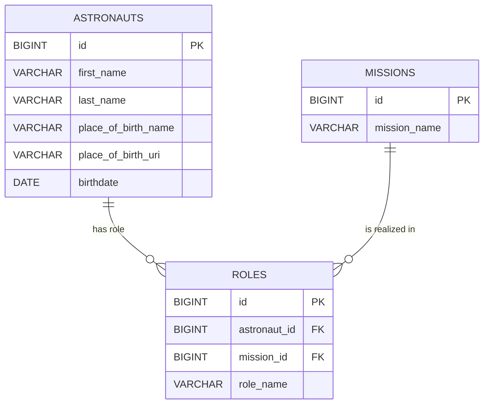

# Ontop tutorial HemaFAIR
Materials for the Ontop tutorial during the HemaFAIR Federated Learning Hackathon. During the tutorial, data from a small database will be mapped to RDF using Ontop and its mapping language OBDA.

## Source database model



## Deployment (Linux)
```git clone https://github.com/dwijnbergen/ontop-hackathon-hemafair.git```

Clones this repository.

```sh create_python_env.sh```

Creates a Python virtual environment with RDFLib and DuckDB libraries.

```source activate_python_env.sh```

Actives the python virtual environment.

```python3 create-db.py```

Creates a DuckDB database from the csv files.

```sh download_duckdb_jdbc.sh``` (from the jdbc folder)

Downloads the DuckDB jdbc.

```sudo docker compose up -d```

Starts the container and detaches.
